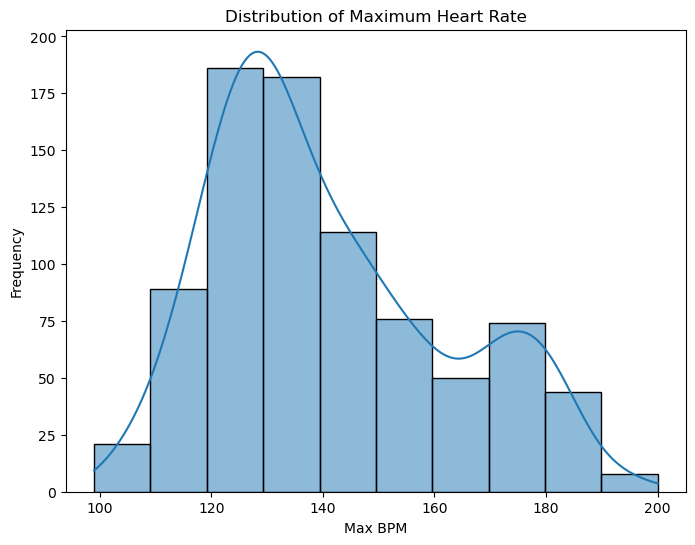
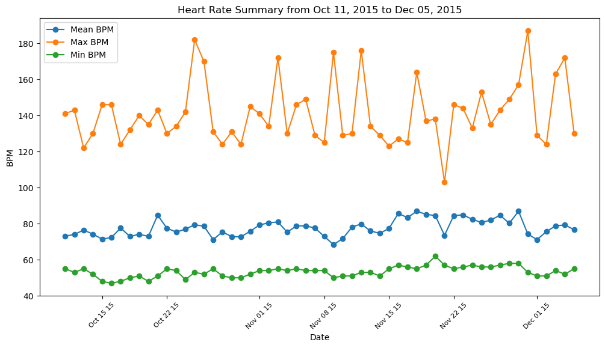
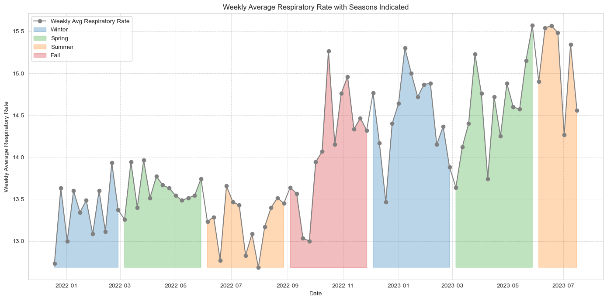

# Fitbit Raw Data Processor & Visualizer

Process and visualize your Fitbit fitness tracker data with ease. This repository contains a Jupyter notebook that helps you break down your raw Fitbit data into consolidated health and fitness metrics and provides visually appealing charts and graphs showcasing your personal health & fitness trends over time.

## Table of Contents

- [Fitbit Raw Data Processor \& Visualizer](#fitbit-raw-data-processor--visualizer)
  - [Table of Contents](#table-of-contents)
  - [Setup](#setup)
  - [Usage](#usage)
  - [Example Charts](#example-charts)
  - [Dependencies](#dependencies)
  - [Support](#support)

## Setup

1. **Download Your Fitbit Data**:

   - Visit [Fitbit's Data Export Page](https://www.fitbit.com/settings/data/export).
   - Request the time range you'd like to export.
   - When the export is ready click on `Download` and it will provide you with a `.zip` file.

2. **Prepare the Data**:

   - Unzip the downloaded file.
   - Place the unzipped folder inside the `data` directory of this repository.

3. **Environment Setup**:
   - Ensure you have Jupyter Notebook installed. If not, you can install it using pip:
     bash`pip install jupyter`
   - Install the required dependencies (see [Dependencies](#dependencies) section).

## Usage

1. **Clone this Repository**:

   - Open your terminal or command prompt.
   - Navigate to the directory where you want to clone the repository.
   - Run the following commands:

```bash
git clone https://github.com/schbz/FitbitEDA.git
cd schbz/FitbitEDA
```

1. **Open the Notebook**:

   - in root directory of the project, launch Jupyter Notebook:

     bash`jupyter notebook`

2. **Configure Your Data Input**:

   - Open the provided notebook from the Jupyter interface.
   - Locate the cell with a line similar to: `user_folder = 'SkyS'`
   - Replace `SkyS` with the name of the folder you placed in the `data` directory.

3. **Run the Notebook**:
   - Run all cells in the notebook.
   - Once processed, you'll find several consolidated `.csv` files inside the `output` directory.
   - Additionally, the notebook will display various charts and graphs detailing your health and fitness trends.

## Example Charts

Here are some example charts you can expect from this notebook:





## Dependencies

This notebook relies on several Python libraries for data processing and visualization:

- `pandas`
- `matplotlib`
- `seaborn`
- `numpy`
- `scipy`

You can install them using pip:

```bash
pip install pandas matplotlib seaborn numpy scipy
```

## Support

For any issues or enhancements, please open a [GitHub issue](https://github.com/YOUR_GITHUB_USERNAME/REPO_NAME/issues).
